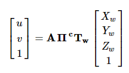
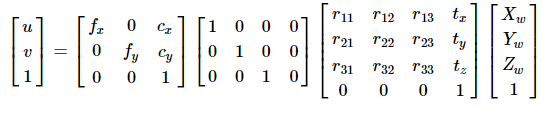

<<<<<<< HEAD
# ORB-SLAM2
**Authors:** [Raul Mur-Artal](http://webdiis.unizar.es/~raulmur/), [Juan D. Tardos](http://webdiis.unizar.es/~jdtardos/), [J. M. M. Montiel](http://webdiis.unizar.es/~josemari/) and [Dorian Galvez-Lopez](http://doriangalvez.com/) ([DBoW2](https://github.com/dorian3d/DBoW2))

**13 Jan 2017**: OpenCV 3 and Eigen 3.3 are now supported.

**22 Dec 2016**: Added AR demo (see section 7).

ORB-SLAM2 is a real-time SLAM library for **Monocular**, **Stereo** and **RGB-D** cameras that computes the camera trajectory and a sparse 3D reconstruction (in the stereo and RGB-D case with true scale). It is able to detect loops and relocalize the camera in real time. We provide examples to run the SLAM system in the [KITTI dataset](http://www.cvlibs.net/datasets/kitti/eval_odometry.php) as stereo or monocular, in the [TUM dataset](http://vision.in.tum.de/data/datasets/rgbd-dataset) as RGB-D or monocular, and in the [EuRoC dataset](http://projects.asl.ethz.ch/datasets/doku.php?id=kmavvisualinertialdatasets) as stereo or monocular. We also provide a ROS node to process live monocular, stereo or RGB-D streams. **The library can be compiled without ROS**. ORB-SLAM2 provides a GUI to change between a *SLAM Mode* and *Localization Mode*, see section 9 of this document.

<a href="https://www.youtube.com/embed/ufvPS5wJAx0" target="_blank"></a>
<a href="https://www.youtube.com/embed/T-9PYCKhDLM" target="_blank"></a>
<a href="https://www.youtube.com/embed/kPwy8yA4CKM" target="_blank"></a>


### Related Publications:

[Monocular] Raúl Mur-Artal, J. M. M. Montiel and Juan D. Tardós. **ORB-SLAM: A Versatile and Accurate Monocular SLAM System**. *IEEE Transactions on Robotics,* vol. 31, no. 5, pp. 1147-1163, 2015. (**2015 IEEE Transactions on Robotics Best Paper Award**). **[PDF](http://webdiis.unizar.es/~raulmur/MurMontielTardosTRO15.pdf)**.

[Stereo and RGB-D] Raúl Mur-Artal and Juan D. Tardós. **ORB-SLAM2: an Open-Source SLAM System for Monocular, Stereo and RGB-D Cameras**. *IEEE Transactions on Robotics,* vol. 33, no. 5, pp. 1255-1262, 2017. **[PDF](https://128.84.21.199/pdf/1610.06475.pdf)**.

[DBoW2 Place Recognizer] Dorian Gálvez-López and Juan D. Tardós. **Bags of Binary Words for Fast Place Recognition in Image Sequences**. *IEEE Transactions on Robotics,* vol. 28, no. 5, pp.  1188-1197, 2012. **[PDF](http://doriangalvez.com/php/dl.php?dlp=GalvezTRO12.pdf)**

# 1. License

ORB-SLAM2 is released under a [GPLv3 license](https://github.com/raulmur/ORB_SLAM2/blob/master/License-gpl.txt). For a list of all code/library dependencies (and associated licenses), please see [Dependencies.md](https://github.com/raulmur/ORB_SLAM2/blob/master/Dependencies.md).

For a closed-source version of ORB-SLAM2 for commercial purposes, please contact the authors: orbslam (at) unizar (dot) es.

If you use ORB-SLAM2 (Monocular) in an academic work, please cite:

    @article{murTRO2015,
      title={{ORB-SLAM}: a Versatile and Accurate Monocular {SLAM} System},
      author={Mur-Artal, Ra\'ul, Montiel, J. M. M. and Tard\'os, Juan D.},
      journal={IEEE Transactions on Robotics},
      volume={31},
      number={5},
      pages={1147--1163},
      doi = {10.1109/TRO.2015.2463671},
      year={2015}
     }

if you use ORB-SLAM2 (Stereo or RGB-D) in an academic work, please cite:

    @article{murORB2,
      title={{ORB-SLAM2}: an Open-Source {SLAM} System for Monocular, Stereo and {RGB-D} Cameras},
      author={Mur-Artal, Ra\'ul and Tard\'os, Juan D.},
      journal={IEEE Transactions on Robotics},
      volume={33},
      number={5},
      pages={1255--1262},
      doi = {10.1109/TRO.2017.2705103},
      year={2017}
     }

# 2. Prerequisites
We have tested the library in **Ubuntu 12.04**, **14.04** and **16.04**, but it should be easy to compile in other platforms. A powerful computer (e.g. i7) will ensure real-time performance and provide more stable and accurate results.

## C++11 or C++0x Compiler
We use the new thread and chrono functionalities of C++11.

## Pangolin
We use [Pangolin](https://github.com/stevenlovegrove/Pangolin) for visualization and user interface. Dowload and install instructions can be found at: https://github.com/stevenlovegrove/Pangolin.

## OpenCV
We use [OpenCV](http://opencv.org) to manipulate images and features. Dowload and install instructions can be found at: http://opencv.org. **Required at leat 2.4.3. Tested with OpenCV 2.4.11 and OpenCV 3.2**.

## Eigen3
Required by g2o (see below). Download and install instructions can be found at: http://eigen.tuxfamily.org. **Required at least 3.1.0**.

## DBoW2 and g2o (Included in Thirdparty folder)
We use modified versions of the [DBoW2](https://github.com/dorian3d/DBoW2) library to perform place recognition and [g2o](https://github.com/RainerKuemmerle/g2o) library to perform non-linear optimizations. Both modified libraries (which are BSD) are included in the *Thirdparty* folder.

## ROS (optional)
We provide some examples to process the live input of a monocular, stereo or RGB-D camera using [ROS](ros.org). Building these examples is optional. In case you want to use ROS, a version Hydro or newer is needed.

# 3. Building ORB-SLAM2 library and examples

Clone the repository:
```
git clone https://github.com/raulmur/ORB_SLAM2.git ORB_SLAM2
```

We provide a script `build.sh` to build the *Thirdparty* libraries and *ORB-SLAM2*. Please make sure you have installed all required dependencies (see section 2). Execute:
```
cd ORB_SLAM2
chmod +x build.sh
./build.sh
```

This will create **libORB_SLAM2.so**  at *lib* folder and the executables **mono_tum**, **mono_kitti**, **rgbd_tum**, **stereo_kitti**, **mono_euroc** and **stereo_euroc** in *Examples* folder.

# 4. Monocular Examples

## TUM Dataset

1. Download a sequence from http://vision.in.tum.de/data/datasets/rgbd-dataset/download and uncompress it.

2. Execute the following command. Change `TUMX.yaml` to TUM1.yaml,TUM2.yaml or TUM3.yaml for freiburg1, freiburg2 and freiburg3 sequences respectively. Change `PATH_TO_SEQUENCE_FOLDER`to the uncompressed sequence folder.
```
./Examples/Monocular/mono_tum Vocabulary/ORBvoc.txt Examples/Monocular/TUMX.yaml PATH_TO_SEQUENCE_FOLDER
```

## KITTI Dataset  

1. Download the dataset (grayscale images) from http://www.cvlibs.net/datasets/kitti/eval_odometry.php 

2. Execute the following command. Change `KITTIX.yaml`by KITTI00-02.yaml, KITTI03.yaml or KITTI04-12.yaml for sequence 0 to 2, 3, and 4 to 12 respectively. Change `PATH_TO_DATASET_FOLDER` to the uncompressed dataset folder. Change `SEQUENCE_NUMBER` to 00, 01, 02,.., 11. 
```
./Examples/Monocular/mono_kitti Vocabulary/ORBvoc.txt Examples/Monocular/KITTIX.yaml PATH_TO_DATASET_FOLDER/dataset/sequences/SEQUENCE_NUMBER
```

## EuRoC Dataset

1. Download a sequence (ASL format) from http://projects.asl.ethz.ch/datasets/doku.php?id=kmavvisualinertialdatasets

2. Execute the following first command for V1 and V2 sequences, or the second command for MH sequences. Change PATH_TO_SEQUENCE_FOLDER and SEQUENCE according to the sequence you want to run.
```
./Examples/Monocular/mono_euroc Vocabulary/ORBvoc.txt Examples/Monocular/EuRoC.yaml PATH_TO_SEQUENCE_FOLDER/mav0/cam0/data Examples/Monocular/EuRoC_TimeStamps/SEQUENCE.txt 
```

```
./Examples/Monocular/mono_euroc Vocabulary/ORBvoc.txt Examples/Monocular/EuRoC.yaml PATH_TO_SEQUENCE/cam0/data Examples/Monocular/EuRoC_TimeStamps/SEQUENCE.txt 
```

# 5. Stereo Examples

## KITTI Dataset

1. Download the dataset (grayscale images) from http://www.cvlibs.net/datasets/kitti/eval_odometry.php 

2. Execute the following command. Change `KITTIX.yaml`to KITTI00-02.yaml, KITTI03.yaml or KITTI04-12.yaml for sequence 0 to 2, 3, and 4 to 12 respectively. Change `PATH_TO_DATASET_FOLDER` to the uncompressed dataset folder. Change `SEQUENCE_NUMBER` to 00, 01, 02,.., 11. 
```
./Examples/Stereo/stereo_kitti Vocabulary/ORBvoc.txt Examples/Stereo/KITTIX.yaml PATH_TO_DATASET_FOLDER/dataset/sequences/SEQUENCE_NUMBER
```

## EuRoC Dataset

1. Download a sequence (ASL format) from http://projects.asl.ethz.ch/datasets/doku.php?id=kmavvisualinertialdatasets

2. Execute the following first command for V1 and V2 sequences, or the second command for MH sequences. Change PATH_TO_SEQUENCE_FOLDER and SEQUENCE according to the sequence you want to run.
```
./Examples/Stereo/stereo_euroc Vocabulary/ORBvoc.txt Examples/Stereo/EuRoC.yaml PATH_TO_SEQUENCE/mav0/cam0/data PATH_TO_SEQUENCE/mav0/cam1/data Examples/Stereo/EuRoC_TimeStamps/SEQUENCE.txt
```
```
./Examples/Stereo/stereo_euroc Vocabulary/ORBvoc.txt Examples/Stereo/EuRoC.yaml PATH_TO_SEQUENCE/cam0/data PATH_TO_SEQUENCE/cam1/data Examples/Stereo/EuRoC_TimeStamps/SEQUENCE.txt
```

# 6. RGB-D Example

## TUM Dataset

1. Download a sequence from http://vision.in.tum.de/data/datasets/rgbd-dataset/download and uncompress it.

2. Associate RGB images and depth images using the python script [associate.py](http://vision.in.tum.de/data/datasets/rgbd-dataset/tools). We already provide associations for some of the sequences in *Examples/RGB-D/associations/*. You can generate your own associations file executing:

  ```
  python associate.py PATH_TO_SEQUENCE/rgb.txt PATH_TO_SEQUENCE/depth.txt > associations.txt
  ```

3. Execute the following command. Change `TUMX.yaml` to TUM1.yaml,TUM2.yaml or TUM3.yaml for freiburg1, freiburg2 and freiburg3 sequences respectively. Change `PATH_TO_SEQUENCE_FOLDER`to the uncompressed sequence folder. Change `ASSOCIATIONS_FILE` to the path to the corresponding associations file.

  ```
  ./Examples/RGB-D/rgbd_tum Vocabulary/ORBvoc.txt Examples/RGB-D/TUMX.yaml PATH_TO_SEQUENCE_FOLDER ASSOCIATIONS_FILE
  ```

# 7. ROS Examples

### Building the nodes for mono, monoAR, stereo and RGB-D
1. Add the path including *Examples/ROS/ORB_SLAM2* to the ROS_PACKAGE_PATH environment variable. Open .bashrc file and add at the end the following line. Replace PATH by the folder where you cloned ORB_SLAM2:

  ```
  export ROS_PACKAGE_PATH=${ROS_PACKAGE_PATH}:PATH/ORB_SLAM2/Examples/ROS
  ```
  
2. Execute `build_ros.sh` script:

  ```
  chmod +x build_ros.sh
  ./build_ros.sh
  ```
  
### Running Monocular Node
For a monocular input from topic `/camera/image_raw` run node ORB_SLAM2/Mono. You will need to provide the vocabulary file and a settings file. See the monocular examples above.

  ```
  rosrun ORB_SLAM2 Mono PATH_TO_VOCABULARY PATH_TO_SETTINGS_FILE
  ```
  
### Running Monocular Augmented Reality Demo
This is a demo of augmented reality where you can use an interface to insert virtual cubes in planar regions of the scene.
The node reads images from topic `/camera/image_raw`.

  ```
  rosrun ORB_SLAM2 MonoAR PATH_TO_VOCABULARY PATH_TO_SETTINGS_FILE
  ```
  
### Running Stereo Node
For a stereo input from topic `/camera/left/image_raw` and `/camera/right/image_raw` run node ORB_SLAM2/Stereo. You will need to provide the vocabulary file and a settings file. If you **provide rectification matrices** (see Examples/Stereo/EuRoC.yaml example), the node will recitify the images online, **otherwise images must be pre-rectified**.

  ```
  rosrun ORB_SLAM2 Stereo PATH_TO_VOCABULARY PATH_TO_SETTINGS_FILE ONLINE_RECTIFICATION
  ```
  
**Example**: Download a rosbag (e.g. V1_01_easy.bag) from the EuRoC dataset (http://projects.asl.ethz.ch/datasets/doku.php?id=kmavvisualinertialdatasets). Open 3 tabs on the terminal and run the following command at each tab:
  ```
  roscore
  ```
  
  ```
  rosrun ORB_SLAM2 Stereo Vocabulary/ORBvoc.txt Examples/Stereo/EuRoC.yaml true
  ```
  
  ```
  rosbag play --pause V1_01_easy.bag /cam0/image_raw:=/camera/left/image_raw /cam1/image_raw:=/camera/right/image_raw
  ```
  
Once ORB-SLAM2 has loaded the vocabulary, press space in the rosbag tab. Enjoy!. Note: a powerful computer is required to run the most exigent sequences of this dataset.

### Running RGB_D Node
For an RGB-D input from topics `/camera/rgb/image_raw` and `/camera/depth_registered/image_raw`, run node ORB_SLAM2/RGBD. You will need to provide the vocabulary file and a settings file. See the RGB-D example above.

  ```
  rosrun ORB_SLAM2 RGBD PATH_TO_VOCABULARY PATH_TO_SETTINGS_FILE
  ```
  
# 8. Processing your own sequences
You will need to create a settings file with the calibration of your camera. See the settings file provided for the TUM and KITTI datasets for monocular, stereo and RGB-D cameras. We use the calibration model of OpenCV. See the examples to learn how to create a program that makes use of the ORB-SLAM2 library and how to pass images to the SLAM system. Stereo input must be synchronized and rectified. RGB-D input must be synchronized and depth registered.

# 9. SLAM and Localization Modes
You can change between the *SLAM* and *Localization mode* using the GUI of the map viewer.

### SLAM Mode
This is the default mode. The system runs in parallal three threads: Tracking, Local Mapping and Loop Closing. The system localizes the camera, builds new map and tries to close loops.

### Localization Mode
This mode can be used when you have a good map of your working area. In this mode the Local Mapping and Loop Closing are deactivated. The system localizes the camera in the map (which is no longer updated), using relocalization if needed. 

=======
# VSLAM_PoC_Project
jhyoon 

## develop PROSAC instead of RANSAC and config parser

### RANSAC 사용
- tracking.cc
    - P4P RANSAC
- initializer.cc
    - 8 points RANSAC
- LoopClosing.cc
    - get candidate for matching and optimize with all corespondences

RANSAC을 advanced RANSAC으로 변경시키고자 함.

advanced RANSAC의 종류 : PROSAC, Lo-RANSAC

[RANSAC 설명](https://dkssud8150.github.io/posts/motion_estimation/#ransac)

#### PROSAC

PROSAC은 이미지 매칭에 특화된 RANSAC기법으로 데이터의 prior를 잘 활용하는 기법이다. PROSAC은 descriptor matching을 할 때, L2 norm이나 Hamming distance로 측정하게 되는데, descriptor들 간의 distance가 작을수록 모델 추론을 할 때 더욱 정확하게 추론할 가능성이 높다. 그래서 PROSAC은 낮은 distance를 가진 descriptor match를 샘플링하도록 만들었다.

PROSAC의 장점은 운이 나빠서 완전 실패하더라도, 기존의 RANSAC으로 수렴하기에 반드시 기존의 RANSAC보다 성능이 좋다는 것이다. 또, PROSAC은 기존의 RANSAC의 큰 반복에 비해 5~10개의 loop만으로 최적의 모델을 찾는 경우가 많다.

<br>

- PROSAC 동작 방식

1. 2개의 이미지에 대해 descriptor matching을 수행한다. 이 과정에서 match마다의 descriptor간의 distance를 기록한다.
2. distance를 오름차순으로 정렬한다. 
3. 몇개씩 탐색할지에 대한 size(n)을 지정해준다. 
4. distance 리스트에서 n개의 top data를 샘플링한다. 
5. 샘플링한 데이터들로 모델을 추론한다. 
6. 좋은 결과가 나오면 score값을 업데이트하고, 원래의 score보다 낮으면 n을 증가시킨다. 
7. 다시 4번으로 돌아간다. 

기존의 RANSAC기법은 처음에 무작위로 데이터를 추출하고, 그 데이터를 기반으로 모델을 추정하기 때문에 어떤 경우는 빨리 찾지만, 어떤 경우는 찾지 못할 확률도 존재한다. 그래서 PROSAC에서는 descriptor matching이라는 prior정보를 기반으로 데이터를 샘플링하여 빠르게 탐색할 수 있다.

<br>

<br>

현재까지는 homography에 대한 PROSAC기법을 제작했다. computehomography 함수만 camera pose 즉, PnP solver에 대한 것으로 변경시키면 될 것 같다.

<br>

homography 추론 방법은 다음과 같다.
1. pair에 들어있는 점들, 즉 이미지 2개에 대한 픽셀 위치를 사용하여 추론 matrix를 만든다.
2. SVD(singular value decompisition) 을 수행한다.
3. NxN 행렬에서 제일 마지막 값인 N번째 행의 값들을 통해 3x3 homography 매트릭스로 재생성한다.
4. homography matrix와 point1, point2를 통해 point1과 homography의 다차원 내적으로 얻은 point2_estimate 점과 실제 특징점인 point2를 비교한다.
5. 비교한 값이 500보다 작으면 best score에 업데이트한다.

<br>

> 1. homography로 추정하는 방법에 궁금한 것이 있는데, SVD로 VT를 구한 후 9x9에서 가장 마지막 행만을 가져와서 homography로 만드는게 맞는 건가. 
> 2. homography를 구할 때 normalization을 수행하던데, 어떤 곳은 (2,2)에 있는 값으로 나누어 주기도 하고, 어떤 곳은 전체에 대해 L2-norm을 수행하기도 한다. 어떤게 정확한가.
> 3. opencv 튜토리얼을 보니 이렇게 Rotation matrix와 translation matrix를 구하던데 이게 맞는 건가여? 
>   ```cpp
>   H = findHomography(objectPoints, imagePoints);
>   Mat c1  = H.col(0);
>   Mat c2  = H.col(1);
>   Mat c3 = c1.cross(c2); 
>   Mat tvec = H.col(2);
>   Mat R(3, 3, CV_64F);
>   for (int i = 0; i < 3; i++)
>   {
>   R.at<double>(i,0) = c1.at<double>(i,0);
>   R.at<double>(i,1) = c2.at<double>(i,0);
>   R.at<double>(i,2) = c3.at<double>(i,0);
>   }
>   ```
> 4. homography를 정규화하는 것과 homography를 통해 출력된 값을 정규화하는 것이 결과가 같나요?

<br>

camera pose, PnP를 수행하는 방법은 PnP solver를 통해 나온 값은 camera coordinate와 world coordinate로의 rotation matrix, translation matrix 변환 행렬이다. 이를 통해 world coordinat에서의 원점을 camera coordinate로 투영함으로써 camera pose를 찾을 수 있다.



- (Xw,Yw,Zw) : world points in world coordinate
- (u,v) : image points in image plane that world points are projected
- II : perspective projection model
- A : camera intrinsic matrix

<br>

이 식을 정리하면 다음과 같다.



첫번째 행렬은 intrinsic matrix, 세번째 행렬은 extrinsic matrix(rotation matrix, translation matrix)이다.

ORB-SLAM2에서 사용하는 방법은 다음과 같다. (PnPsolver.cc - iterate, compute_pose)
1. SVD (cv::SVD)
2. gauss newton (gauss newton)
3. reprojection error (rep_err)
4. get Rvec, Tvec (compute_pose)
5. check inlier about rvec, tvec (checkinlier)

이를 수행하기에 앞서 world 좌표계와 image 좌표계를 구해야 한다. 이는 `GetWorldPos`를 통해 얻은 `map point`를 저장한 리스트인 mvP3D와 keypoint가 저장된 mvP2D이다.

그렇기에 map point를 연산하는 방법을  찾는 것이 중요하다. 연산하는 것은 `localMapping.cc`에 `createNewMapPoints` 에서 현재 keyframe들에 대해 epipolar geometry와 triangulation을 통해 map point를 생성한다. 

<br>

추가적으로 camera pose를 계산할 때는 2가지 방법이 있다.
1. 2D-2D feature correspondence를 가지고 있고, object points가 모두 평면 위에 존재할 경우 homography를 사용하는 것이 좋다.
   - homography를 통해 rvec, tvec을 구할 경우 아래 tutorial과 동일하게 구할 수 있다.
   ```cpp
    Mat H = findHomography(objectPointsPlanar, imagePoints);
    cout << "H:\n" << H << endl;
    // Normalization to ensure that ||c1|| = 1
    double norm = sqrt(H.at<double>(0,0)*H.at<double>(0,0) +
                       H.at<double>(1,0)*H.at<double>(1,0) +
                       H.at<double>(2,0)*H.at<double>(2,0));
    
    H /= norm;
    Mat c1  = H.col(0);
    Mat c2  = H.col(1);
    Mat c3 = c1.cross(c2);
    Mat tvec = H.col(2);
    Mat R(3, 3, CV_64F);
    for (int i = 0; i < 3; i++)
    {
        R.at<double>(i,0) = c1.at<double>(i,0);
        R.at<double>(i,1) = c2.at<double>(i,0);
        R.at<double>(i,2) = c3.at<double>(i,0);
    }
   ```
      - https://docs.opencv.org/4.x/d0/d92/samples_2cpp_2tutorial_code_2features2D_2Homography_2pose_from_homography_8cpp-example.html
   - homography를 연산하는 방법은 위와 같이 findhomography를 사용할수도 있지만, 직접 구현해서 사용할 수도 있다.
   ```cpp
   Mat computeHomography(const Mat &R_1to2 ,const Mat &tvec_1to2, const double d_inv, const Mat &normal)
   {
      Mat homography = R_1to2 + d_inv * tvec_1to2 * normal.t();
      return homography
   }
   ```
      - 이 때 구한 homography는 euclidean 형태를 가지므로 사용 가능한 형태로 만들어줘야 한다. 이를 위해 intrinsic matrix를 사용한다.
      ```cpp
      cv::Mat homography_euclidean = computeHomography(R_1to2, t_1to2, d_inv1, normal1);
      cv::Mat homography = cameraMatrix * homography_euclidean * cameraMatrix.inv();
      ```
      - https://docs.opencv.org/4.x/de/d45/samples_2cpp_2tutorial_code_2features2D_2Homography_2decompose_homography_8cpp-example.html
   - 마지막으로는 중간 단계에서 normalization을 수행해야 한다. 편의성을 위해 l2-norm을 사용한다. 또는 homography에서 가장 마지막 값인 (2,2)에 있는 값으로 나눠줄 수도 있다.
   ```cpp
   // L2-norm
   double norm = sqrt(H.at<double>(0,0)*H.at<double>(0,0) +
                       H.at<double>(1,0)*H.at<double>(1,0) +
                       H.at<double>(2,0)*H.at<double>(2,0));
   H /= norm;
   
   // 마지막 값으로 나눠주기
   homography /= homography.at<double>(2,2);
   homography_euclidean /= homography_euclidean.at<double>(2,2);
   ```
   - 그냥 opencv tutorial에 따라 eucliean형태로 homography를 구했다면 마지막 값으로 나누고, findhomography를 통해 구했으면 l2-norm을 사용하려고 한다. 대체로 많이 사용되는 것이 l2-norm이므로 잘 모르겠으면 이를 사용해도 좋다.
   - euclidean을 사용할 때는 2개의 이미지에 대해 camera displacement인 rvec, tvec를 알고 있다는 가정 하에 homography를 추정하는 것이다. 그러나 findhomography를 사용할 경우는 2개의 평면에 대해 image points를 가지고 있어야 한다. 후자의 방법이 2개의 이미지에 대해 특징점만 추출하면 되므로 간단하다.
   - [] 특징점 matching을 통해 homography를 추론하고, 이를 통해 카메라 pose를 찾을 수 있다. 이렇게 나온 카메라 포즈를 GT값과 비교하여 PROSAC에 집어넣으면 된다.
2. 2D-3D feature correspondence를 가지고 있을 경우는 PnPsolver를 사용하는 것이 좋다.
   - ORB-SLAM2이 PnPsolver를 사용하고 있다. 

<br>

<br>


<br>

<br>

---

### Config 파일

<yaml open>
  <summary> yaml파일 내용 </summary>

```yaml
%YAML:1.0
# kitti00-02.yaml
#--------------------------------------------------------------------------------------------
# Camera Parameters. Adjust them!
#--------------------------------------------------------------------------------------------

# Camera calibration and distortion parameters (OpenCV) 
Camera.fx: 718.856
Camera.fy: 718.856
Camera.cx: 607.1928
Camera.cy: 185.2157

Camera.k1: 0.0
Camera.k2: 0.0
Camera.p1: 0.0
Camera.p2: 0.0

# Camera frames per second 
Camera.fps: 30.0

# Color order of the images (0: BGR, 1: RGB. It is ignored if images are grayscale)
Camera.RGB: 1

#--------------------------------------------------------------------------------------------
# ORB Parameters
#--------------------------------------------------------------------------------------------

# ORB Extractor: Number of features per image
ORBextractor.nFeatures: 2000

# ORB Extractor: Scale factor between levels in the scale pyramid 	
ORBextractor.scaleFactor: 1.2

# ORB Extractor: Number of levels in the scale pyramid	
ORBextractor.nLevels: 8

# ORB Extractor: Fast threshold
# Image is divided in a grid. At each cell FAST are extracted imposing a minimum response.
# Firstly we impose iniThFAST. If no corners are detected we impose a lower value minThFAST
# You can lower these values if your images have low contrast			
ORBextractor.iniThFAST: 20
ORBextractor.minThFAST: 7


##### Method

FeaturePoint: "ORB" # FAST, SHIFT, SURF

#--------------------------------------------------------------------------------------------
# Viewer Parameters
#--------------------------------------------------------------------------------------------
Viewer.KeyFrameSize: 0.1
Viewer.KeyFrameLineWidth: 1
Viewer.GraphLineWidth: 1
Viewer.PointSize: 2
Viewer.CameraSize: 0.15
Viewer.CameraLineWidth: 2
Viewer.ViewpointX: 0
Viewer.ViewpointY: -10
Viewer.ViewpointZ: -0.1
Viewer.ViewpointF: 2000


#-----------------------------------------------
# Front End Parameters
#-----------------------------------------------

RANSAC_method: RANSAC #"PROSAC" "Lo-RANSAC"


#-----------------------------------------------
# Back End Parameters
#-----------------------------------------------
```

</yaml>

```cpp
//
// Created by dkssu on 2022-06-17.
//

#include <iostream>
#include <algorithm>
#include <map>
#include <string>
#include <fstream>

int main()
{
    std::string path = "/workspace/testc/src/config.yaml";
    std::map<std::string, std::string> m_table;
    std::ifstream openFile(path);
    if (openFile.is_open()) {
        std::string line;
        while (getline(openFile, line)) {
        std::string delimiter = ": ";
            if (std::string::npos == line.find(delimiter)) delimiter = " : ";
            
            // substr(start, count), return [start, start + count)
            // find(first, last, val), point of first value of val from first to last, if same value not exist in str, return last.
            std::string token1 = line.substr(0, line.find(delimiter));
            if (line.find("#") == std::string::npos) // if not find value, return npos = -1
            int length = line.length();
            else
            {
            int length = line.find("#");
            std::cout << length << std::endl;
            }
            
            std::string token2 = line.substr(line.find(delimiter) + delimiter.length(), line.find("#") - line.find(delimiter) - 2);
            m_table[token1] = token2;
            
            std::cout << "name is " << token1 << ", value is " << token2 << std::endl << std::endl;
            }
        openFile.close();
    }
    else
    {
        std::cout << "do not exist file" << std::endl;
    }
    std::string name1 = "ORBextractor.nFeatures";
    if (m_table.find(name1) == m_table.end())
        throw std::invalid_argument("Not exist name");
    else
    {
        int ORBextractor_nFeatures = std::stoi(m_table[name1]);
        std::cout << "ORB feature number is " << ORBextractor_nFeatures << std::endl;
    }
  
    std::string name2 = "RANSAC method";
    if (m_table.find(name2) == m_table.end())
        throw std::invalid_argument("Not exist name");  
    else
    {
        std::string RANSAC_method = m_table[name2];
    
        if (RANSAC_method.compare("RANSAC")) {
            std::cout << "filtering method is RANSAC" << std::endl;
        }
        else if(RANSAC_method.compare("PROSAC")) {
            std::cout << "filtering method is PROSAC" << std::endl;
        }
    }
}
```
>>>>>>> feature/FE
